# Smart-Taxi
# une plateforme en ligne pour la réservation des taxis
# Overview
**Smart Taxi** est mon projet PFS (projet de fin semestre), une application web sur laquelle j'ai travaillé avec mon équipe pour moderniser le service des taxis classiques au Maroc, en implémentant une plateforme de réservation en ligne, un suivi en temps réel et une évaluation des chauffeurs.

  

# Introduction

L’application **Smart Taxi** a été conçue pour moderniser et améliorer l’efficacité des taxis classiques au Maroc. En réponse à la dispersion spatiale de l’habitat et à l’augmentation du trafic, cette application permet aux taxis de se connecter à une plateforme en ligne, facilitant ainsi leur localisation et réservation par les clients. Grâce à des fonctionnalités avancées telles que la géolocalisation, les utilisateurs peuvent facilement trouver et réserver des taxis à proximité. Cette solution innovante intègre les taxis traditionnels dans l’écosystème numérique actuel, répondant ainsi à la demande croissante de services de transport plus efficaces et connectés.

## Caractéristiques

- **Système de réservation de taxis** : Les utilisateurs peuvent réserver un taxi en quelques clics via l'application web, facilitant ainsi l'accès aux taxis classiques.
  
- **Géolocalisation en temps réel** : Les passagers et chauffeurs peuvent visualiser leurs positions respectives sur une carte, permettant une connexion rapide et efficace.
  
- **Optimisation des trajets** : L'application utilise des algorithmes de recherche de chemin pour proposer le trajet le plus rapide, réduisant ainsi les délais et les détours inutiles.

## Interface utilisateur
### Authentification
**La page Home**

Cette image représente la page d’accueil de notre application web. Elle montre les différents services offerts par l’application, ainsi que les deux boutons pour la création du compte chauffeur en cliquant sur "Driver" et la création du compte passager en cliquant sur "Client", ainsi que le bouton de connexion pour accéder à l’application.
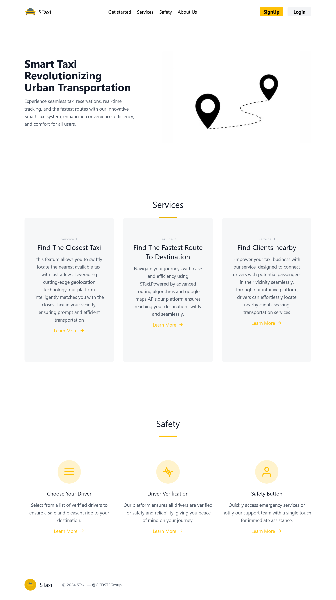

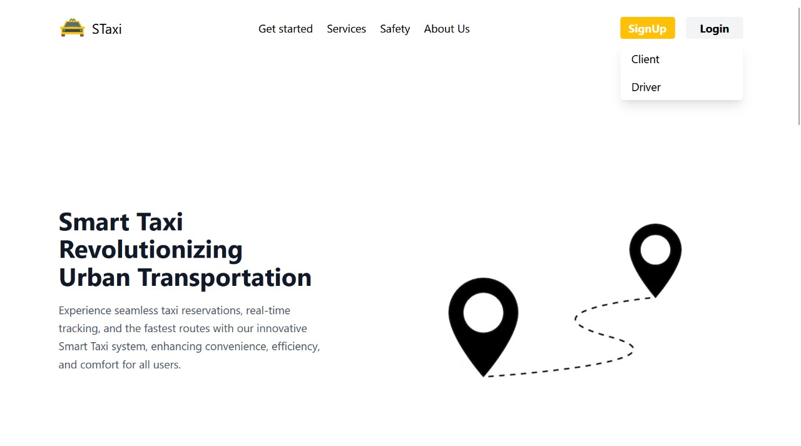

**Creation du compte Chauffeur**

le formulaire d’inscription pour les chauffeurs.

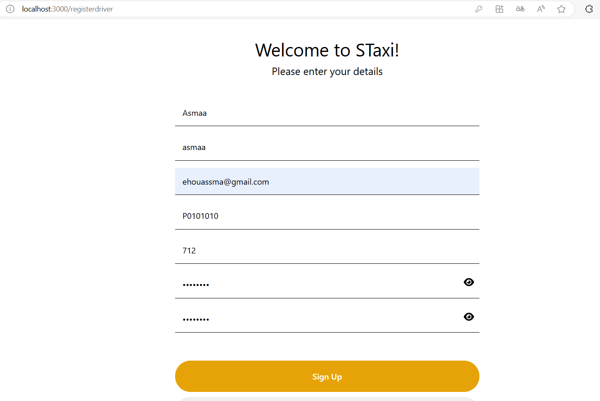

**Login Page**

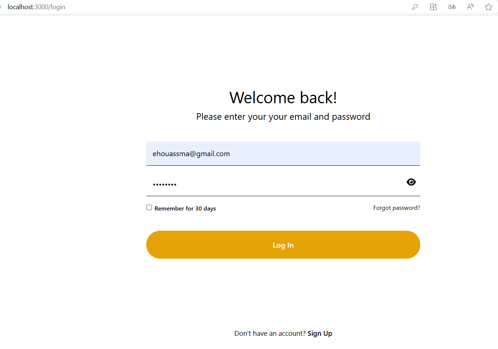

**Creation du compte Passager**

le formulaire d’inscription pour passager

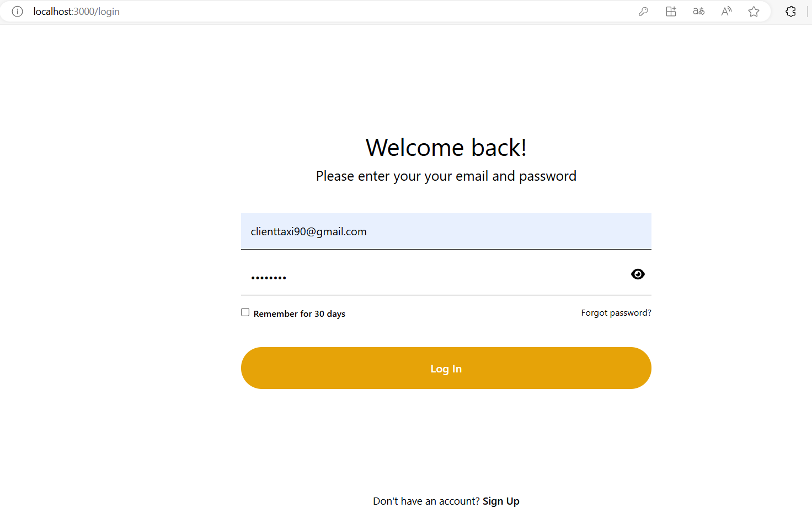

**Les interfaces du Passager et Chauffeur**

Lorsque le passager se connecte, sa localisation en temps réel est affichée sur cette carte avec un marqueur rouge, facilitant son identification par les chauffeurs de taxi. En bas de la page, une section intitulée "Incoming Requests" liste les demandes des chauffeurs.

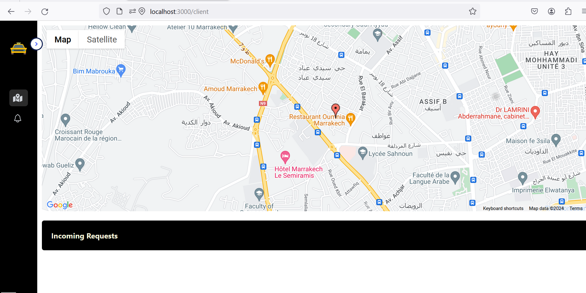

Lorsqu’un chauffeur se connectera à sa page, sa position en temps réel sera affichée sur la carte avec un marqueur jaune. Ce marqueur permettra de visualiser immédiatement la localisation proactive du chauffeur, et les utilisateurs pourront facilement suivre et repérer sa position.

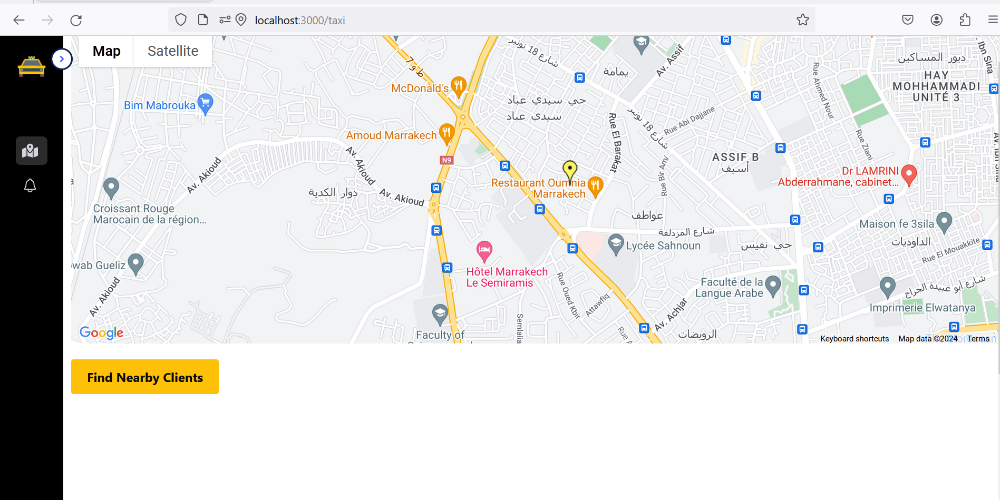

Lorsque l’application récupère la localisation des taxis existants en se basant sur les chauffeurs connectés en même temps, leur position est affichée sur la carte de la page du passager. Cela permet aux passagers de voir en temps réel où se trouvent les taxis disponibles à proximité.

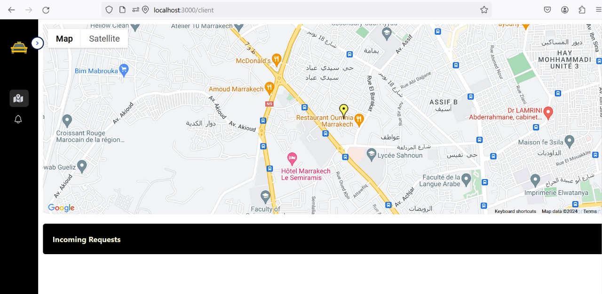

De même, lorsque la localisation des passagers existants est repérée, leur position est affichée sur la carte de la page du chauffeur. Lorsqu’il clique sur "Find Clients Nearby", tous les clients à proximité seront affichés avec un bouton "Send Request" pour envoyer une demande au passager correspondant.

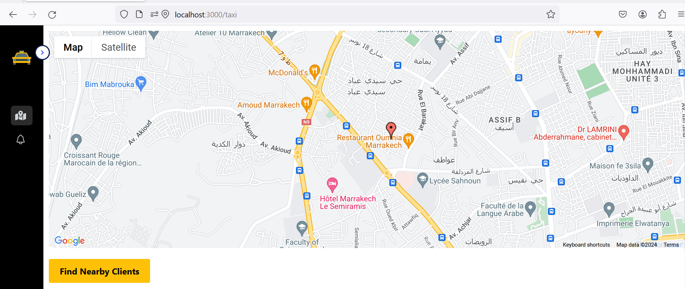

Le chauffeur peut envoyer une demande au passager à condition que ce dernier se trouve dans sa zone de couverture, plus précisément dans **un cercle de 4 km de diamètre**.

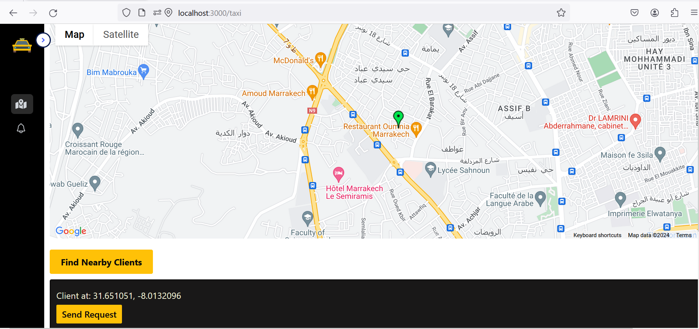

Par la suite, les requêtes envoyées par les chauffeurs disponibles, mentionnant leur localisation, seront affichées chez le passager. Ce dernier peut soit accepter la demande du chauffeur, soit la refuser.

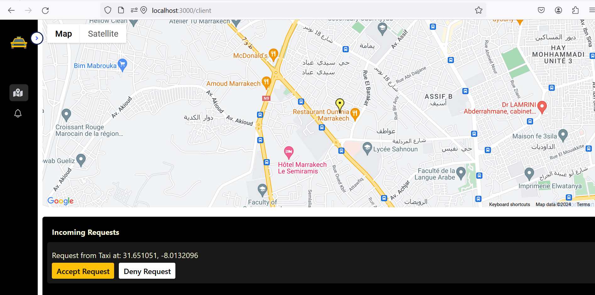

Si le passager accepte la demande du chauffeur en cliquant sur le bouton **Accept Request**, il pourra alors specifier manuellement sa destination sur la carte

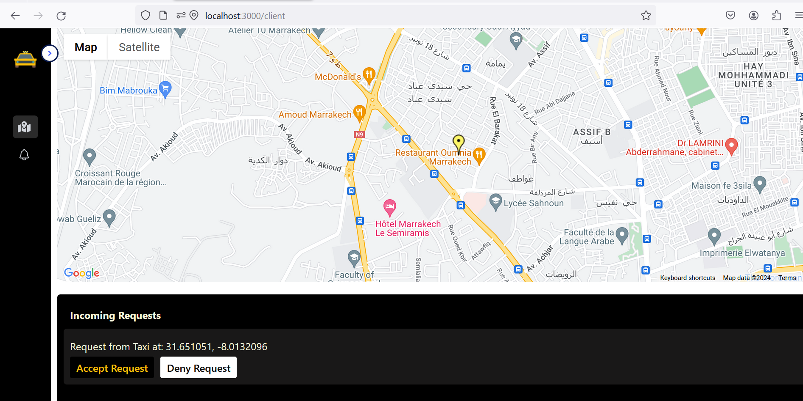

Lorsque le passager accepte la requête du chauffeur, l’emplacement de sa destination sera clairement indiqué sur la carte du chauffeur, permettant ainsi à ce dernier de visualiser précisément où se rendre. De plus, le chemin optimal vers cette destination sera tracé sur la carte, fournissant ainsi au chauffeur une assistance visuelle pour atteindre rapidement et efficacement le lieu de destination du passager.

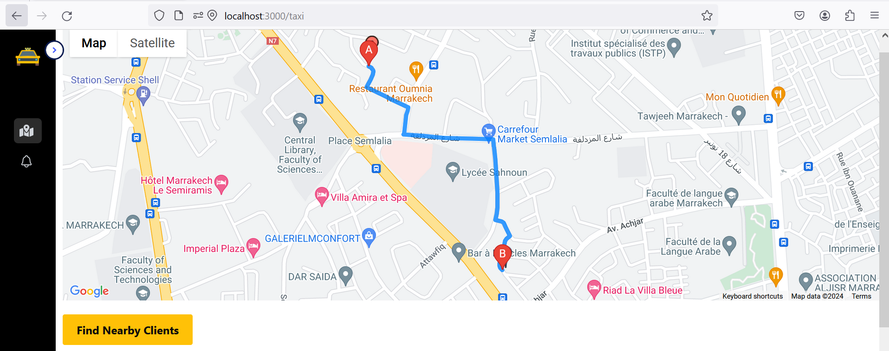

## Outils

## Technologies Utilisées

<table align="center">
  <tr>
    <td align="center" width="90">
      
       React
    </td>
    <td align="center" width="90">
      
       Node.js
    </td>
   <td align="center" width="90">
      
       Express Js
    </td>
    <td align="center" width="90">
      
       MongoDB
    </td>
    <td align="center" width="90">
        
         Google Maps APIs
   </tr>
 </table>
 
- **Frontend** : React.js
- **Backend** : Node.js, Express.js
- **Base de données** : MongoDB
- **API** : Google Maps APIs

**En conclusion**, ce projet de smart taxi constitue une solution innovante aux défis majeurs du secteur, en améliorant l'efficacité des trajets et la satisfaction des utilisateurs.

## Membres d'équipe

- [Asmaa Ehou](https://github.com/Asmaaeh) 
- [Imane Chaik](https://github.com/rivenos) 
- [Hajar Ed-darrajy](https://github.com/haizy1) -Author

